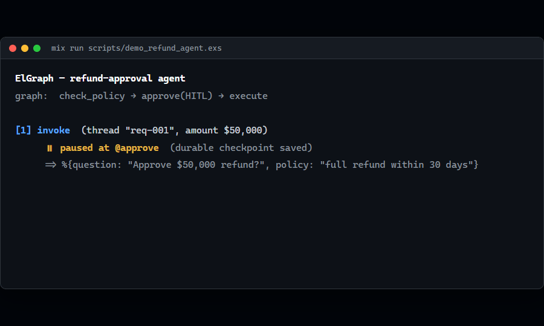
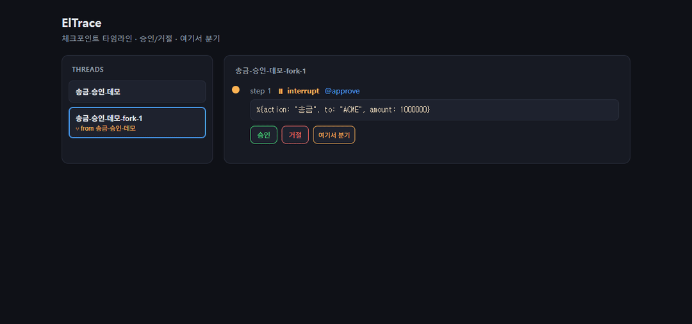
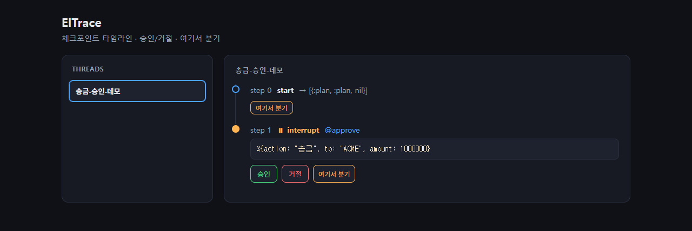

# ElGraph

[English](README.md) | **한국어**

[](https://hex.pm/packages/el_graph)
[](https://hexdocs.pm/el_graph)
[](https://github.com/showjihyun/ElGraph/actions/workflows/ci.yml)
[](LICENSE)
[](https://livebook.dev/run?url=https%3A%2F%2Fraw.githubusercontent.com%2Fshowjihyun%2FElGraph%2Fmain%2Fnotebooks%2Fgetting_started.livemd)

> **BEAM(Elixir/OTP) 위에서 도는 graph-first 에이전트 프레임워크.**
> Python 의존성 없이 LangGraph의 내구 실행·HITL(사람 개입)·체크포인트를 제공하고,
> 그 위에 실시간 관측 UI(ElTrace)까지 얹는다.



*▶ 환불 승인 에이전트: 그래프가 실행되다 **사람의 승인을 기다려 멈추고**(HITL), 결정을 받아 재개한 뒤,
**time-travel**로 멈춘 체크포인트를 분기해 다른 결정을 시도한다(원본 실행은 보존). 키 없이 실행:
`mix run apps/el_graph/scripts/demo_refund_agent.exs`*



*🎬 **ElTrace** — 에이전트 실행을 브라우저에서 실시간으로 보고, 인터럽트에서 **승인/거절**(HITL)하고,
과거 시점에서 **"여기서 분기"**(time-travel)한다. 직접 보기: `cd apps/el_trace && mix phx.server` → http://localhost:4000*

LLM 에이전트를 **상태 채널 + 노드 + 엣지**로 선언하면, ElGraph가 체크포인트 기반으로
실행한다. 중간에 멈춰 사람의 승인을 받고(HITL), crash가 나도 마지막 지점부터 재개하며,
과거의 임의 시점으로 되감아 "다르게 가봤다면?"을 안전하게 탐색할 수 있다.

```
사용자 입력 ─▶ [graph 실행] ─▶ 체크포인트마다 저장
                  │
                  ├─ 인터럽트 → 사람이 승인/거절 → 재개
                  └─ 과거 step에서 분기(fork) → if 시나리오 탐색
```

---

## 🤔 왜 ElGraph? (3줄 요약)

1. **LLM 에이전트를 그래프로 선언** → ElGraph가 체크포인트 기반으로 실행한다.
2. **멈추고(HITL)·되감고(time-travel)·죽어도 재개**한다 — 체크포인터 한 줄로 켜는 내구 실행(opt-in).
3. **Python·외부 인프라 없이** BEAM 런타임이 동시성·장애복구·실시간을 공짜로 준다 (코어 의존성은 흔한 Elixir 라이브러리 몇 개 — `:telemetry`·`:req`·`:jason`·`:nimble_options`·`:opentelemetry_api` — 무거운 프레임워크 없음).

> 한 줄: *LangGraph가 Python에서 라이브러리로 힘겹게 재구현한 것이, BEAM에선 런타임 기본이다.*

## ✨ 핵심 특징

- **그래프 코어** — 상태 채널/reducer, 조건부 엣지, 병렬 fan-out, 서브그래프. 런타임 의존성 최소(`:telemetry` + 흔한 라이브러리 `:req`/`:jason`/`:nimble_options`/`:opentelemetry_api`); 무거운 OTel SDK는 선택 앱 `el_graph_otel`에 격리.
- **내구 실행** — 체크포인트 저장 → 재개. 부분 실패한 병렬 단계도 성공한 작업을 보존하고, `Ctx.memo/3` **task 메모이제이션**으로 재개·재시도 시 LLM/툴 호출을 재실행하지 않는다. 백엔드 교체 가능: **ETS**(인메모리) · **DETS·Mnesia**(BEAM 내장·무인프라 디스크 영속) · **Postgres** · **Valkey/Redis**. 전부 `keep: {:last, n}` 보존정책 지원.
- **사람 개입(HITL)** — 노드 앞이나 노드 안에서 멈춰 사람의 답을 받고 그 지점부터 이어간다.
- **time-travel** — 임의 과거 체크포인트에서 새 thread로 분기. 원본은 보존된다.
- **에이전트 런타임** — GenServer 에이전트, 시그널 버스, ReAct 프리셋, LLM/MCP 어댑터, 비용 가드, 가드레일/PII, **구조화 출력 재시도**(스키마 검증 실패 시 오류 되먹임).
- **메모리** — 3-스코프(episodic/semantic/procedural) + 시점진실·**temporal 쿼리**(`fact_at`)·**충돌해소**·시맨틱 회수. 교체형 `Memory.Backend`(네이티브/**Mem0**/**Zep**), Store는 ETS/Valkey/Postgres로 영속.
- **분산 (BEAM 내장)** — `:pg` 시그널 버스 + **at-least-once 멱등 수신**(Signal id/Dedup, netsplit 재전달 흡수), 멀티노드 `:peer` 검증, libcluster는 호스트 위임.
- **상호운용 (양방향 MCP)** — ElGraph Action을 **MCP 서버**로 노출(HTTP `/mcp` + stdio, tools/resources/prompts) + **MCP 클라이언트**(Streamable HTTP, sampling/elicitation/roots 양방향). A2A HTTP·AG-UI SSE도 제공.
- **실시간 관측 UI (ElTrace)** — thread 생애를 브라우저 타임라인으로 보고, 인터럽트에서 승인/거절·여기서 분기를 클릭으로. telemetry 계측(invoke/node/llm.chat span + retry/interrupt/checkpoint/bus/sensor 이벤트) → OTel 브리지 → Langfuse.

> 왜 Elixir인가? LangGraph가 Python에서 *라이브러리로 재구현*한 것들(내구 실행·병렬 격리·
> 스트리밍 버스·분산 워커)이 BEAM에선 런타임 기본이다. 같은 기능을 더 적은 코드로, 더 강한 보장과 함께.
> 상세: [`docs/elixir-vs-python-comparison.md`](docs/elixir-vs-python-comparison.md).

---

## 🚀 빠른 시작

### 1. 준비물

- **Elixir 1.18+** / **Erlang/OTP 27+** (개발은 Elixir 1.20 / OTP 28에서 검증)
- 설치 (택1):
  - **macOS**: `brew install elixir`
  - **Linux · macOS (버전 관리)**: [asdf](https://asdf-vm.com) (`asdf plugin add erlang && asdf plugin add elixir`)
  - **Windows**: `scoop install erlang elixir` — 자세히는 [`docs/ENVIRONMENT.md`](docs/ENVIRONMENT.md)

설치 확인:

```bash
elixir --version    # Elixir 1.18 이상이면 OK
```

### 2. 설치

**A) 내 프로젝트에 의존성으로 추가** — `mix.exs`:

```elixir
def deps do
  [
    {:el_graph, "~> 0.3"}
  ]
end
```

> 최신 미출시 변경이 필요하면 git 서브디렉터리도 가능:
> `{:el_graph, github: "showjihyun/ElGraph", sparse: "apps/el_graph"}`. git·Hex 모두 공개라 **설치에 인증이 필요 없다**(`mix hex.user auth`는 *올리는 사람*만의 단계).

코어 `el_graph`만으로 헤드리스(서버 없는) 에이전트 런타임이 된다. 내구 체크포인터(Postgres/Redis)·
관측 UI(ElTrace)·A2A/AG-UI HTTP 서버는 형제 앱으로 분리돼 있다(아래 *프로젝트 구조* 참고).

**B) ElGraph를 직접 클론해서 보거나 개발** — 이 저장소는 **우산(umbrella) 프로젝트**다:

```bash
git clone https://github.com/showjihyun/ElGraph.git
cd ElGraph
mix deps.get        # 의존성 설치
mix test            # 전체 테스트 (전부 async) — 통과하면 환경 OK
```

> Windows에서 `mix`를 못 찾으면 PATH를 잡아준다(자세히는 ENVIRONMENT.md):
> ```powershell
> $env:Path = "$env:USERPROFILE\scoop\shims;$env:USERPROFILE\scoop\apps\elixir\current\bin;$env:Path"
> ```

### 3. 첫 그래프 30초 체험

```bash
iex -S mix
```

```elixir
graph =
  ElGraph.new()
  |> ElGraph.state(:n, default: 0)
  |> ElGraph.add_node(:double, fn %{n: n}, _ctx -> %{n: n * 2} end)
  |> ElGraph.add_node(:inc, fn %{n: n}, _ctx -> %{n: n + 1} end)
  |> ElGraph.add_edge(:double, :inc)
  |> ElGraph.compile(entry: :double)

ElGraph.invoke(graph, %{n: 10})
#=> {:ok, %{n: 21}}
```

노드는 `(state, ctx)`를 받아 **상태 부분 업데이트 맵**을 돌려준다. 그게 전부다.

**키 없이 첫 에이전트** — `ElGraph.Test.ScriptedLLM`이 미리 정한 응답을 돌려주므로, API 키 없이
ReAct 에이전트 루프를 그대로 돌려볼 수 있다:

```elixir
alias ElGraph.{LLM, Presets}
alias ElGraph.Test.ScriptedLLM

{:ok, pid} = ScriptedLLM.start_link([LLM.assistant("안녕하세요! 무엇을 도와드릴까요?")])
graph = Presets.react({ScriptedLLM, pid}, [])

ElGraph.invoke(graph, %{messages: [LLM.user("안녕")]})
#=> {:ok, %{messages: [%{role: :user, ...}, %{role: :assistant, content: "안녕하세요! ..."}], ...}}
```

준비되면 실제 어댑터로 교체한다 — `ElGraph.LLM.OpenAI` / `.Anthropic` / `.Gemini`.

### 4. 관측 UI 띄우기 (추천 — 가장 직관적)

```bash
cd apps/el_trace
mix phx.server
```

브라우저에서 **http://localhost:4000** 을 열면, 승인 대기 중인 예제 thread가 보인다.
타임라인을 실시간으로 따라가며 **승인/거절**하거나, 특정 step에서 **여기서 분기**해
"거절했다면?" 시나리오를 새 thread로 만들어 볼 수 있다.



> 브라우저 LiveView를 처음 띄울 땐 자바스크립트 자산을 한 번 빌드한다:
> `mix esbuild el_trace` (또는 `mix phx.server`가 dev에서 자동 처리).

---

## 🧩 ElGraph가 빛나는 곳

ElGraph의 강점이 Agentic AI 시대의 실제 수요 — **내구성·사람 감독·결함 격리** — 와 맞아떨어지는
세 지점. 핵심은 "더 빠른 처리량"이 아니다.

### 1. 고위험 행동의 사람 승인 게이트 — *거버넌스 / 감독*

**수요:** 현실 행동(환불·결제·배포)을 하는 에이전트는 되돌릴 수 없는 단계 전에 사람의 승인을 위해
멈춰야 한다 — 그 대기는 몇 시간·며칠, 프로세스 재시작을 넘길 수 있다.
**ElGraph의 강점:** `Ctx.interrupt/2`가 멈추고 *체크포인트를 저장*한다. 대기 중 OS 프로세스가
죽어도 `resume`이 완료된 작업을 재실행하지 않고 결정을 주입한다. 거절한 분기는 time-travel로 따로 탐색.

```elixir
# 계획 → 사람을 위해 멈춤(내구적) → 승인 후에만 실행.
approve = fn %{action: a, amount: amt}, ctx ->
  %{decision: Ctx.interrupt(ctx, %{review: a, amount: amt})}
end

graph =
  ElGraph.new()
  |> ElGraph.state(:action) |> ElGraph.state(:amount) |> ElGraph.state(:decision)
  |> ElGraph.add_node(:plan, &Planner.run/2)       # LLM이 고위험 행동을 제안
  |> ElGraph.add_node(:approve, approve)           # ← 사람 게이트(체크포인트됨)
  |> ElGraph.add_node(:execute, &Executor.run/2)   # 승인 후에만 실행
  |> ElGraph.add_edge(:plan, :approve)
  |> ElGraph.add_edge(:approve, :execute)
  |> ElGraph.compile(entry: :plan)

cp = {ElGraph.Checkpointer.Postgres, ElGraph.Checkpointer.Postgres.config(MyApp.Repo)}

{:interrupted, %{payload: review}} = ElGraph.invoke(graph, input, checkpointer: cp, thread_id: id)
# → `review`를 UI에 표시; 몇 시간 뒤, 어떤 노드/프로세스에서든:
{:ok, result} = ElGraph.resume(graph, checkpointer: cp, thread_id: id, resume: "approved")
```

### 2. 크래시에 강한 장시간 에이전트 — *신뢰성(에이전트용 Temporal)*

**수요:** 딥리서치·멀티툴·수시간 에이전트는 일시적 실패(레이트리밋, 불안정 API)를 만난다. 재시도
시 비싼 LLM 호출을 다시 돌리거나 완료된 병렬 작업을 잃으면 안 된다.
**ElGraph의 강점:** step별 체크포인트 + `Ctx.memo/3`(재개·재시도 시 LLM/툴 호출 재실행 안 함) +
부분 실패 보존(병렬 팬아웃이 절반 실패해도 성공분 보존) + 노드별 `retry:`.

```elixir
# 비싼 LLM 작업을 메모이즈 — 크래시를 넘겨 재개·재시도해도 다시 돌지 않는다.
research = fn %{topic: t}, ctx ->
  %{findings: Ctx.memo(ctx, {:research, t}, fn -> deep_research(t) end)}
end

graph =
  ElGraph.new()
  |> ElGraph.state(:topic) |> ElGraph.state(:findings) |> ElGraph.state(:report)
  |> ElGraph.add_node(:research, research)
  |> ElGraph.add_node(:source_a, &SourceA.fetch/2)  # 병렬 형제: 하나가 도중 실패해도
  |> ElGraph.add_node(:source_b, &SourceB.fetch/2)  # 다른 쪽의 완료 작업은 보존된다
  |> ElGraph.add_node(:write, &Writer.run/2, retry: [max: 3, backoff: :exponential])
  |> ElGraph.add_edge(:research, :source_a)
  |> ElGraph.add_edge(:research, :source_b)
  |> ElGraph.add_edge(:source_a, :write)
  |> ElGraph.add_edge(:source_b, :write)
  |> ElGraph.compile(entry: :research)

# Mnesia = 디스크 영속·외부 인프라 0. 도중 크래시 → 마지막 체크포인트부터 재개;
# 완료된 노드와 메모이즈된 LLM 호출은 재실행하지 않는다(중복 과금 없음).
cp = {ElGraph.Checkpointer.Mnesia, ElGraph.Checkpointer.Mnesia.config(pid)}
ElGraph.invoke(graph, %{topic: "..."}, checkpointer: cp, thread_id: "job-42")
```

### 3. 결함 격리된 에이전트 플릿 — *운영 규모*

**수요:** 장수명 에이전트를 다수 동시 운영(사용자별 비서·모니터링·지원 플릿)할 때, 폭주하거나 죽는
한 에이전트가 나머지를 절대 무너뜨리면 안 된다 — 멀티 에이전트 오케스트레이션과 실시간 관측도 필요.
**ElGraph의 강점:** BEAM이 각 에이전트에 선점 스케줄링되는 **결함 격리** 프로세스를 준다.
오케스트레이션 템플릿(`supervisor` / `group_chat` / `magentic`)이 이들을 조율하고, ElTrace가 모든
실행을 실시간으로 보여준다. *(정직한 단서: I/O 대기형 LLM 호출에선 이점이 "속도"가 아니라 격리·
내구·값싼 장수명 세션이다.)*

```elixir
# 슈퍼바이저 LLM이 전문 워커(각각 name + description + run 함수를 가진 맵)로 라우팅한다.
workers = [
  %{name: :researcher, description: "자료 조사", run: &MyApp.research/2},
  %{name: :coder, description: "코드 작성", run: &MyApp.code/2},
  %{name: :support, description: "사용자 응대", run: &MyApp.support/2}
]

team = ElGraph.Orchestration.supervisor({ElGraph.LLM.OpenAI, api_key: key}, workers, max_steps: 16)

# 독립적인 장수명 사용자별 에이전트를 수천 개 팬아웃. 스케줄러가 모든 코어를 쓰고,
# 한 실행의 크래시·폭주는 완전히 격리된다 — 나머지는 계속 돈다.
1..10_000
|> Task.async_stream(
     fn user ->
       ElGraph.invoke(team, %{messages: [LLM.user(user.request)]},
         checkpointer: cp, thread_id: "user-#{user.id}")
     end,
     max_concurrency: System.schedulers_online() * 50,
     ordered: false
   )
|> Stream.run()
# 모든 실행을 실시간으로 — 승인/거절, "여기서 분기" — ElTrace UI에서 본다.
```

---

## ⚖️ LangChain · LangGraph vs ElGraph

> 한 줄 요약: **LangGraph가 Python에서 "라이브러리로 재구현"해야 했던 것들이 BEAM에선 런타임 기본이다.**
> 그래서 같은 기능을 *더 적은 코드·더 적은 인프라·더 강한 보장*으로 제공한다.

### 한눈에 — LangChain · LangGraph · ElGraph

> **계층이 다르다**: **LangChain**은 프롬프트·툴·RAG를 잇는 *조립 라이브러리*, **LangGraph**는 그 위에서 상태·내구 실행을 다루는 *그래프 상태머신* 계층(그래서 별도로 분리돼 나왔다). **ElGraph의 직접 비교 대상은 LangGraph**이고, BEAM 위라 LangGraph가 외부에 의존하던 것(실시간 UI·분산·자기치유)까지 런타임에 흡수한다.

| | **LangChain** | **LangGraph** | **ElGraph** |
|---|---|---|---|
| 한마디 | LLM "조립" 라이브러리 | Python 그래프 상태머신 | **BEAM** 그래프 상태머신 |
| 핵심 역할 | 프롬프트·툴·RAG 체인 | 내구 실행·HITL·체크포인트 | 〃 **+ 실시간 관측·분산** |
| 실행 모델 | 체인/DAG (얕은 상태) | 그래프 + 채널/reducer | 그래프 + 채널/reducer |
| 런타임 | Python (asyncio/GIL) | Python (asyncio/GIL) | BEAM (경량프로세스·선점·분산 내장) |
| 내구 실행·재개 | ✖ (범위 밖) | ✔ 라이브러리로 재구현 | ✔ **런타임과 한 몸** |
| HITL · time-travel | ✖ | ✔ HITL / 되감기 일부 | ✔ HITL **+ 과거 시점 분기(fork)** |
| 장애 격리·자기치유 | 앱코드 + 외부 인프라 | 앱코드 + 외부 인프라 | **Supervisor·프로세스 격리(언어 표준)** |
| 동시성 | GIL 제약 | GIL 제약 | **전 코어·격리된 경량 프로세스** |
| 의존성·배포 | 전이 의존성 다수 | 전이 의존성 다수 | 코어 의존성 **최소**(흔한 라이브러리 몇 개)·단일 릴리스 |
| 실시간 UI | 별도 구성 | 별도 구성 | **LiveView 동일 모델**(ElTrace·인프라 0) |

에이전트 오케스트레이터는 결국 **"수많은 동시 I/O 대기 + 상태 관리 + 장애 복구"** 문제다.
이건 BEAM(Erlang/Elixir 런타임)이 30년간 통신 교환기에서 풀어온 바로 그 문제다.

| 평가 항목 | LangGraph (Python) | **ElGraph (Elixir/BEAM)** | ElGraph 이점 |
|---|---|---|---|
| **동시 실행** | asyncio 이벤트 루프 / GIL로 CPU 단일코어 | 경량 프로세스 수백만 개, 전 코어 자동 활용 | ◐ 격리·상태 보존엔 강함; 순수 I/O 바운드 fan-out은 asyncio도 충분 |
| **API 모양** | `invoke`/`ainvoke` 이중 API (colored functions) | 선점형 스케줄링 → **단일 API** | ✅ "동기/비동기 함수 색깔" 문제 자체가 없음 |
| **장애 격리** | 모든 경계에 `try/except`, 놓치면 전체 전파 | 프로세스 격리 + Supervisor 트리 (crash-only) | ✅ 한 에이전트의 죽음이 다른 에이전트를 못 죽임 |
| **자기 치유** | K8s 재시작·Celery 재시도 등 **외부 인프라** 필요 | 슈퍼바이저 재시작 + 체크포인트 복구가 **언어 표준** | ✅ 장수명 에이전트의 복구가 프레임워크 안에서 성립 |
| **내구 실행/체크포인트** | 라이브러리로 재구현 | 런타임 + 체크포인트가 한 몸 | ✅ 부분 실패한 병렬 단계도 성공분 보존 → LLM 중복 호출 차단 |
| **상태 안전성** | 가변 dict ("복사해서 쓰라"고 문서가 경고) | 모든 데이터 불변 | ✅ 병렬 브랜치 데이터 레이스가 **언어적으로 불가능** |
| **실시간 UI** | FastAPI + SSE/WebSocket 별도 구성 | Phoenix LiveView와 메시지 모델 동일 | ✅ 에이전트 이벤트 → 브라우저가 **추가 인프라 0** (← ElTrace가 그 증거) |
| **분산/스케일아웃** | Redis/RabbitMQ/Kafka + Celery 필수 | distributed Erlang + `:pg` 내장 | ✅ 노드 경계를 넘는 핸드오프도 코드 거의 동일 |
| **배포·공급망** | 전이 의존성 수십 개, 이미지 수백 MB | 코어 **의존성 소수**(무거운 프레임워크 없음), `mix release` 단일 바이너리 | ✅ 공급망 표면적·이미지 크기 대폭 감소 |

### 정직하게 — LangGraph가 더 나은 곳

ML/모델 인접 작업은 Python이 우위다: 프로바이더 SDK·토크나이저·평가 도구·로컬 모델(PyTorch)이
Python 우선이고, 커뮤니티·튜토리얼·인력 풀도 압도적이다. ElGraph는 이를 **HTTP API + MCP로 우회**한다
— 오케스트레이터가 모델을 직접 실행할 일은 없으므로 이 우회는 구조적으로 타당하다.
(임베딩/토크나이저는 API의 `usage` 응답이나 MCP 툴로 흡수.)

**"Python 두뇌, Elixir 신경계."** 2026년 실전 패턴은 둘 중 하나를 고르는 게 아니라 역할 분담이다 —
모델(추론·임베딩·파인튜닝)은 Python/호스티드 API에 두고, ElGraph는 그것을 호출하는 *내구·동시·관측
가능한 오케스트레이션 층*을 맡는다(MCP·A2A·HTTP로 연결). ElGraph는 ML 스택을 대체하려 하지 않는다.

**BEAM 동시성도 솔직하게.** 위 표들은 BEAM이 *할 수 있는 것*(수만 동시·전 코어)을 보여준다 — 다만 그게
*언제 실익인지*는 구분하는 게 정직하다. 단순 요청→LLM→응답처럼 *네트워크 대기(I/O 바운드)*가 전부인
워크로드에선 BEAM의 이점이 크지 않다: Python asyncio도 수천 동시 호출을 충분히 처리하고, 실제 병목은
보통 모델/GPU 용량이지 오케스트레이터 런타임이 아니다. BEAM이 *결정적으로* 앞서는 지점은 따로 있다 —
**장애 격리**(한 대화가 죽어도 나머지 수천이 계속), **선점 스케줄링**(폭주 노드가 다른 에이전트를 굶기지
않음), **상태 보존 장수명 세션**(Phoenix가 서버당 10만+ 동시 연결을 버티는 그 모델), **내구 실행·분산**.
즉 "더 많은 동시 호출"이 아니라 **격리·내구·상태 보존**이 진짜 우위다.

### 그래서, 언제 ElGraph인가

- ✅ **동시 1만+ 에이전트 / 장수명("항상 살아있는") 에이전트 / 자기 치유**가 필요할 때
- ✅ **실시간 관측·사람 개입(HITL) UI**가 제품의 일부일 때 (ElTrace로 인프라 추가 없이)
- ✅ **적은 인프라로 분산**까지 가야 할 때 (브로커·워커풀 운영 부담 없이)
- ✅ **공급망/이미지 최소화**가 중요한 운영 환경

반대로 빠른 ML 실험·로컬 모델 직접 구동·Python 생태계 밀착이 핵심이면 LangGraph가 편하다.

> 전체 항목별 상세 비교(동시성·정확성·장애복구·스트리밍·분산·배포)는
> [`docs/elixir-vs-python-comparison.md`](docs/elixir-vs-python-comparison.md).

### Elixir 생태계에서 — 어디에 서는가

같은 BEAM 위에도 좋은 에이전트 도구가 있다. ElGraph의 자리는 *그래프 실행기*다:

- **Jido** (성숙·~1.7k★) — 불변 함수형 에이전트 + 시그널/FSM. persistence·checkpoints·HITL도 있지만 *전체 에이전트 스냅샷*(hibernate/thaw)이지 노드 단위 버전 체크포인트·pending writes가 아니고, 조건/순환 그래프 실행기는 아니다.
- **sagents** (brainlid/langchain 기반) — HITL 승인이 강점이나 실행이 *고정 선형 파이프라인*이고 체크포인트는 종료시점 저장이다(중간 step 재개 아님).
- **Oban Pro Workflows** — 진짜 내구 동적 fan-out/fan-in. 단 *유료·비순환(DAG)*이고 그래프-상태 체크포인트·HITL이 없다.

ElGraph만의 조합: **노드 단위 버전 체크포인트 + pending writes + 인터럽트 HITL + 조건/순환 그래프 위 동적 fan-out**을 한 런타임에서, 오픈 코어로. 단일 축이 아니라 *이 묶음*이 차별점이다.

## 📦 프로젝트 구조

```
ElGraph/                  # 우산 루트 (여기서 mix test / mix format)
├─ apps/
│  ├─ el_graph/           # 코어 런타임 — 그래프·체크포인트·에이전트·LLM/MCP (의존성 최소)
│  ├─ el_graph_web/       # A2A(JSON-RPC)·AG-UI(SSE) HTTP 서버 — Plug/Bandit
│  ├─ el_trace/           # 관측 UI — Phoenix/LiveView (el_graph에 의존)
│  ├─ el_graph_ecto/      # 내구 체크포인터 — Postgres (Ecto)
│  ├─ el_graph_redis/     # 내구 체크포인터 — Valkey/Redis (Redix)
│  ├─ el_graph_req_llm/   # LLM 어댑터 — ReqLLM 경유 ~21 프로바이더
│  └─ el_graph_otel/      # OTel SDK 브리지 — telemetry→OTel/Langfuse
├─ examples/
│  └─ observed_agent/     # el_graph+el_trace를 "의존성으로 끌어다 쓰는" 예제
├─ notebooks/             # Livebook 예제 (브라우저에서 바로 실행)
│  └─ getting_started.livemd
├─ config/                # 공유 설정 (secrets.exs는 gitignore)
├─ docker-compose.yml     # DB 백엔드 테스트용 Postgres/Valkey
└─ docs/                  # 설계 전문·환경·테스트 규약
```

내구 체크포인터는 코어의 `ElGraph.Checkpointer` behaviour를 구현한 **교체 가능한 어댑터**다.
ETS는 인메모리(빠르지만 재시작 시 소실), 나머지는 재시작·노드 교체를 넘어 thread를 재개한다:

```elixir
# BEAM 내장 — 외부 인프라 0 (코어 el_graph에 포함)
cp = {ElGraph.Checkpointer.Dets,   ElGraph.Checkpointer.Dets.config(pid)}    # 단일 파일
cp = {ElGraph.Checkpointer.Mnesia, ElGraph.Checkpointer.Mnesia.config(pid)}  # 분산 가능(disc_copies)
# 외부 DB (선택적 형제 앱)
cp = {ElGraph.Checkpointer.Postgres, ElGraph.Checkpointer.Postgres.config(MyApp.Repo)}
cp = {ElGraph.Checkpointer.Redis,    ElGraph.Checkpointer.Redis.config(:my_redix)}

ElGraph.invoke(graph, input, checkpointer: cp, thread_id: "t1")
```

Postgres는 마이그레이션이 필요하다: `mix el_graph.ecto.gen.migration -r MyApp.Repo` → `mix ecto.migrate`.

- **`el_graph`** 만 쓰면 헤드리스(서버 없이) 에이전트 런타임이다.
- **`el_trace`** 는 거기에 실시간 관측/개입 UI를 더한다. 범용 trace(span/토큰)는 Langfuse 같은
  도구에 위임하고, ElGraph 체크포인트만이 아는 인과(인터럽트·thread 생애·time-travel)에 집중한다.

---

## 📖 조금 더 — 5분 투어

### ReAct 에이전트 (한 줄 프리셋)

```elixir
llm = {ElGraph.LLM.OpenAI, api_key: System.fetch_env!("OPENAI_API_KEY")}
graph = ElGraph.Presets.react(llm, [MyApp.SearchAction], budget: [tokens: 100_000])

{:ok, %{messages: messages}} =
  ElGraph.invoke(graph, %{messages: [ElGraph.LLM.user("엘릭서 검색해줘")]})
```

LLM이 툴을 호출하면 자동 실행 → 결과를 다시 모델에 넣는 루프가 돈다. 어댑터:
`ElGraph.LLM.OpenAI` / `.Anthropic` / `.Gemini`
(+ `.ReqLLM` — [ReqLLM](https://hex.pm/packages/req_llm) 경유 ~21 프로바이더·1000+ 모델, `el_graph_req_llm` 앱),
테스트용 `ElGraph.Test.ScriptedLLM`.

### 내구 실행 + 사람 승인(HITL)

```elixir
cp = {ElGraph.Checkpointer.ETS, ElGraph.Checkpointer.ETS.config(pid)}

# 승인이 필요한 지점에서 멈춘다
{:interrupted, %{node: :approve, payload: payload}} =
  ElGraph.invoke(graph, input, checkpointer: cp, thread_id: "t1")

# 사람의 답을 주입해 재개 — 멈춘 지점부터, 완료된 노드는 재실행하지 않는다
{:ok, final} = ElGraph.resume(graph, checkpointer: cp, thread_id: "t1", resume: "approved")
```

### time-travel 분기 (ElTrace)

```elixir
ElTrace.observe("t1", graph, cp)                 # UI에 등록
{:ok, fork_id, _} = ElTrace.fork("t1", 1, as: "t1-거절")   # step 1에서 분기
ElGraph.resume(graph, checkpointer: cp, thread_id: fork_id, resume: "거절")  # 원본은 보존
```

전체 동작 예제는 [`examples/observed_agent`](examples/observed_agent) 참고.

---

## 📚 문서

| 문서 | 내용 |
|---|---|
| [`docs/SPEC.md`](docs/SPEC.md) | 설계 전문, 마일스톤, 검토 이력 |
| [`docs/ENVIRONMENT.md`](docs/ENVIRONMENT.md) | 개발 환경 설정 (Windows/scoop) |
| [`docs/TDD-SPEC.md`](docs/TDD-SPEC.md) | 테스트 규약 (TDD, 전부 async) |
| [`docs/elixir-vs-python-comparison.md`](docs/elixir-vs-python-comparison.md) | LangGraph 대비 |
| [`docs/ecosystem-review.md`](docs/ecosystem-review.md) | 생태계 검토 & 적용 제안 (Elixir/OSS 프레임워크 분석) |
| [`docs/DOGFOODING.md`](docs/DOGFOODING.md) | 실사용 관찰 로그 |

---

## 🛠 개발

```bash
mix test                       # 전체 (el_graph + el_trace)
mix test --only integration    # 실 API 호출 (config/secrets.exs 필요)
mix format                     # 커밋 전 필수

# 단일 앱 테스트는 해당 앱 디렉터리에서
cd apps/el_trace && mix test test/el_trace/sessions_test.exs
```

규약: TDD(red → green → refactor), 전 테스트 `async: true`. 자세히는 [`docs/TDD-SPEC.md`](docs/TDD-SPEC.md).

실 LLM 키가 필요하면 템플릿을 복사해 채운다 (커밋 금지 — gitignore됨):

```bash
cp config/secrets.example.exs config/secrets.exs
```

---

## 상태

M1(코어) ~ M5(멀티 에이전트/분산) 코어가 구현·검증됐고, 관측 트랙은 ElTrace LiveView
(Timeline 시각화·승인/거절·여기서 분기)까지 동작한다. 마일스톤 상세는 [SPEC §8](docs/SPEC.md).

## 라이선스

[MIT](LICENSE)
